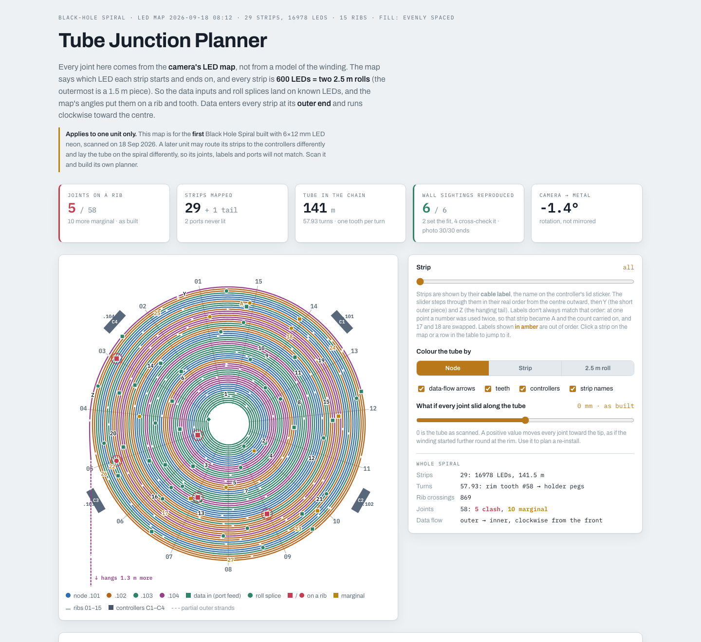
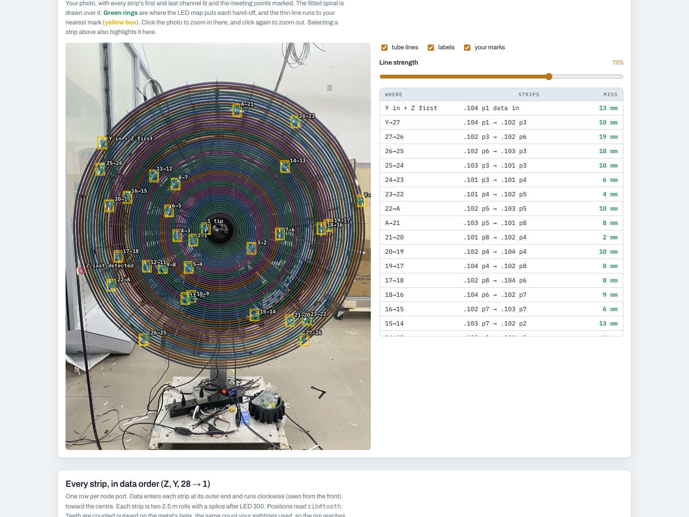

# Tube junction planner

**Live page:** [https://stephanschulz.ca/black-hole-spiral/](https://stephanschulz.ca/black-hole-spiral/)





After a rebuild, copy the page so GitHub Pages stays current:

```
cp tube_junction_planner.html ../docs/index.html
```

**Only for the first 6×12 mm unit** (LED scan of 18 Sep 2026). Another unit may route strips to controllers
and lay the tube on the spiral differently. Give it its own scan, lid labels (`LID_LABELS`) and build.

Open `tube_junction_planner.html` in a browser. Its data is built in, so it needs no server.

The page places every LED of the 18 Sep 2026 pixel-mapper scan (`../pixel mapping scans/`) onto the metal ribs,
and is checked against the photo of lit strip ends in the same folder. From that it shows:

- where each strip (one node port, 600 LEDs, two 2.5 m rolls) **starts and ends**, as a rib and tooth
- the **data direction**: every strip is fed at its outer end and runs clockwise (seen from the front) toward the centre
- **every rib it passes**, in data order
- whether each **data-input joint** and each **roll splice** lands on a rib (clash), near one (marginal), or clear
- which node IP and Art-Net port drive which part of the spiral (manual Q42 / Q72)

## Strip names

Strips are shown by their **cable label**, the name on each controller's lid sticker (`LID_LABELS` in the
build). The lid lists its strips in the order of Art-Net ports 4, 1, 6, 2, 7, 8, 5, 3. Each strip also has
a **position**, counted from the centre (1 = innermost, ending at the camera). The slider and tables run in
position order.

Labels and positions agree except in two places. **A** is the 22nd strip, and labels 22–27 sit at positions
23–28. Labels **17 and 18 are swapped** (label 18 is the 17th strip, label 17 the 18th). The page shows
out-of-order labels in amber. **Y** is the short outer piece and **Z** the hanging tail. `strips.csv` has
both columns, and `strip_match_list.csv` is the full match list.

## Photo overlay

The page has a photo panel. It draws the fitted spiral, the predicted hand-offs (green rings, labelled
like `28→27`) and your marks (yellow boxes) on the photo. Click the photo to zoom in, and click a row
to jump to that joint. `photo_check.py` writes the data for it; the build inlines the photo
(`photo_check_base.jpg`) so the page stays a single file.

## Files

| file | what |
|---|---|
| `tube_junction_planner.html` | the planner. Data sits between `/*DATA:BEGIN*/` and `/*DATA:END*/` |
| `build_planner_data.py` | rebuilds everything from the scan and the metal |
| `../pixel mapping scans/` | the scan: raw detections, the two fill options (`_evenly_spaced`, `_interpolated`), the marked photo |
| `scan/` | the scan's `.meta.json` (node IPs, used to spot ports that never lit) |
| `photo_check.py` | finds the marks in the photo, fits the phone pose, pairs marks with predicted strip ends |
| `photo_check.json`, `photo_check.jpg` | its result, and a static copy of the overlay |
| `make_manual_figure.py` | writes the map figure for the manual (`../manual/images/tube-planner-map.png`); the photo figure is a copy of `photo_check.jpg` |
| `photo_check_base.jpg` | the plain photo at 1200 px, inlined into the page for the photo panel |
| `metal_ribs.json` | 15 rib angles, rib numbers and 860 measured tooth radii (from the B-rep, via planner v1) |
| `strips.csv` | one row per strip: node, port, universes, start/end rib#tooth, turns, ribs passed |
| `junctions.csv` | one row per joint: kind, position, nearest rib, clearance, verdict |
| `planner_data.json` | everything the page draws |
| `archive/` | planner v1 (metal-only model) and the 70/m tube cut plan, copied from `3d-modeling/projects/black-hole/camera` |

## Rebuild after a new scan

1. Put the new exports in `../pixel mapping scans/` and set `SCAN_NAME` in `build_planner_data.py`.
   Put the new `.meta.json` in `scan/`.
2. Check the `ANCHORS`: each one names a node IP, port and LED that you saw sitting on a particular
   rib and tooth. They use IP and port because pixel-mapper's strand_id numbering changes between exports.
3. Run it with the pixel-mapper venv (numpy, scipy, OpenCV). Pass `interpolated` to use that fill
   instead of the default `evenly_spaced`:

```
PY=/Users/stephanschulz/Documents/cursor_ai/pixel-mapper/.venv/bin/python
$PY build_planner_data.py && $PY photo_check.py && $PY build_planner_data.py
```

The script prints the chain, the rotation, the anchor and check results, and the clash list.

## What is measured and what is assumed

- **Measured:** the neon density, 120 LEDs/m. At 8.33 mm per LED the tube's own radius matches the metal
  to under 1 mm; at 96/m it would be 25 % off. Also measured: the data direction (DMX 1 was seen at each strip's outer end), the chain order (each
  strip ends where the next begins, within 5°), and each LED's angle.
- **Fitted:** which rib is which. Two sightings set a −1.3° rotation, and they agree with each other to
  1.6°. The frame is not mirrored. Four more sightings, not used for the fit, each have a matching joint. That is a consistency
  check, since those sightings don't identify the cable.
- **From the metal:** radius (tooth helix). The tube's own LEDs-per-turn radius agrees to a median of 0.7 mm.
- **Tooth numbers** are helix positions (the count the sightings used). Ribs start at different positions
  (rib 12's innermost tooth is #3), so near the rim, use the from-rim count in the tables.
- **Assumed:** 300 LEDs per roll, a 24 mm joint, a 3.5 mm tooth, and 1° of angular uncertainty
  (the "marginal" band). Controllers: the labelled studio photos confirm controller #n = 192.168.0.10n, at ribs 13/14,
  10/11, 05/06 and 02/03.
- **Checked against the photo:** all 30 marks pair one-to-one with a predicted strip end: the chain's feed
  (.104 p1 and the tail .104 p5 share it, at ribs 02/03), all 28 hand-offs, and the tip. Median miss 9 mm.
- **Outer end:** .104 port 1 is a 178-LED (1.5 m) piece fed at 142° that runs clockwise into .102 port 3.
  .104 port 5 is the outer tail: one 2.5 m roll (300 LEDs) fed at the same point, between ribs 02 and 03.
  It runs anticlockwise along the rim past the tips of ribs 03 and 04. The camera saw 75 LEDs (0.63 m)
  of that stretch; the other 1.9 m hangs free. The planner draws the hang dashed, and its path is assumed
  (`OFF_CHAIN_LEDS` and `HANG_BEND_MM` in the build). It can be selected on the page like any strip.
- **Not covered:** .101 port 5 and .104 port 3, which never lit up.

Note: Developed with AI assistance.
